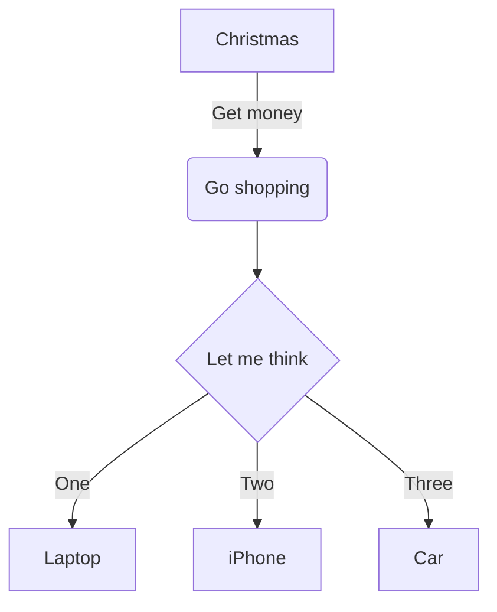
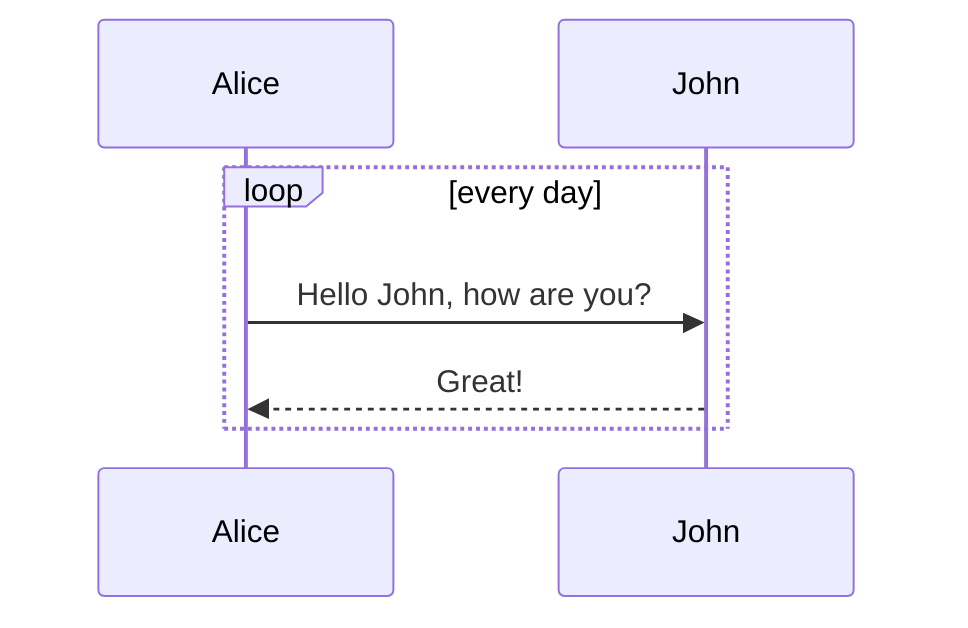
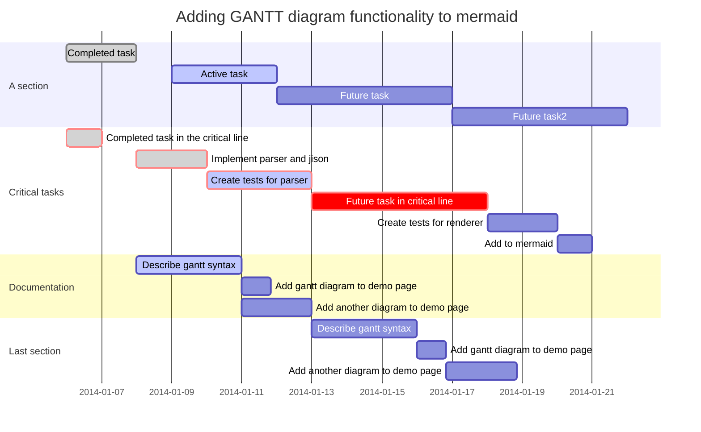

[返回主页][home]


[TOC]


## === 字符 (Character) ===

### *斜体(Italic)*

### **粗体(Bold)**

### ***粗斜体(Bold and italic)***

### ~~删除(strikethrough)~~

### ==标记(mark)==

### 上标(Subscript): H~2~O

### 下标(Superscript): 29^th^


## === 区块 (Block) === 

###  3级标题 (Middle Heading)

###### 6级标题 (Smallest Heading)

### 分割线 (Cut-off Rule) ---
---

### 文本引用 (Quoting Text) >
> 这里显示的是引用内容
> > 二次引用

### 代码引用 `Quoting Text`
``` bash
sudo ls -l # 显示文件详细信息
```
``` c
print("Hello") // 打印
```

### 数学公式 (Mathematical formula) $
- [LaTeX 数学公式语法介绍](https://en.wikibooks.org/wiki/LaTeX/Mathematics)
- 质能方程很简洁: $E = mc^2$
- 数学公式块使用 $$
    $$  x = a_0 + \cfrac{1}{a_1+ \cfrac{1}{a_2 } } $$
- **Typora支持此格式, Hexo需要安装插件**


## === 表格和列表 (Table & List) === 

### 列表 (List) -
- George Washington
- John Adams
- Thomas Jefferson

### 任务表 (Task lists) -[x]
- [ ] a bigger project
- [x] first subtask
- [x] follow up subtask

### 复合列表 (Combined lists)
1. Make my changes
   1. Fix bug
   2. Improve formatting
      - Make the headings bigger
2. Push my commits to GitHub
3. Open a pull request
   - Describe my changes
   - Mention all the members of my team
      - [ ] Ask for feedback
      - [x] No, Thanks

### 表格 (Table) -|-
| Default  | Center Aligned  | Right Aligned |
| -------- | :-------------: | ------------: |
| col 3 is | some wordy text |         $1600 |
| col 2 is |    centered     |           $12 |


## === 链接 (Link) ===

### 网站链接 []()
内联式: [我的博客](https://draapho.github.io/)

引用式: [我的博客][blog]

[blog]: https://draapho.github.io

### 图片链接 
内联式:  

引用式: ![头像][avatar]

[avatar]: https://draapho.github.io/images/avatar.gif

### 链接 <>
博客地址: <https://draapho.github.io/>

### 图标 :Emoji:
:panda_face:  :sparkles:  :camel:  :boom:  :pig:
[emoji cheat sheet](http://www.emoji-cheat-sheet.com/) 

### 脚注 [^Footnote]
[^Footnote]: 这里是脚注


## === 图表 (Diagram) ===
- [mermaid介绍](http://knsv.github.io/mermaid/)
- ***Typora支持此格式, Hexo需要安装插件***

### 流程图 (Flowchart)


### 序列图  (Sequence diagram)


### 甘特图 (Gantt diagram)


### 特殊字符
- 以下字符需要使用跳脱字符`\`来显示

\\ \` \* \_ \{ \} \[ \] \( \) \# \+ \- \. \!

- 显示空格

这一行没有空格

&ensp;这是半字空格, 使用`&ensp;`

&emsp;这是全字空格, 使用`&emsp;`


[返回主页][home]

[Markdown-plus](http://mdp.tylingsoft.com/)

[Markdown-plus Source](https://github.com/tylingsoft/markdown-plus)


[home]: https://draapho.github.io