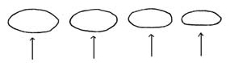

[TOC]

# 总览

- [修行总领——明心见性](https://draapho.github.io/2021/02/13/2104-satori/)
- [修道之路-总纲](https://draapho.github.io/2021/02/14/2105-dao-outline/)
- [介绍本位方法论](https://draapho.github.io/2021/03/01/2106-dao-doubt/)
- [开悟是怎样一种体验？(新)](https://draapho.github.io/2021/04/05/2110-satori2/)
- [带着信仰行到底](https://draapho.github.io/2021/11/29/2124-faith/)
- [心得体会-明心](https://draapho.github.io/2024/09/16/2401-xinming/)
- [克拉克的问答与自己的感想](https://draapho.github.io/2025/08/28/2507-ClarAnswer/)
- [Thusness / PasserBy 的七阶段开悟之路](https://draapho.github.io/2025/12/12/2512-SevenStage/)
- [论无我、空性、摩诃（大）、平常与自然圆成](https://draapho.github.io/2025/12/12/2513-Anatta/)
- [关于婆希耶经(Bahiya Sutta)](https://draapho.github.io/2025/12/12/2514-BahiyaSutta)
- [白话优化版: 不可得的圆满：鼓声、虹光与海市蜃楼如何开启《心经》](https://draapho.github.io/2025/12/12/2515-HeartSutra)
- [体验/觉受、证悟、知见、修行与果位](https://draapho.github.io/2025/12/12/2516-SohAwakening)
- [「我是」的四个面向](https://draapho.github.io/2025/12/12/2517-iam)
- ["I AM" 之后的两种非二元观照](https://draapho.github.io/2025/12/12/2518-NondualContemplation)
- [佛陀的启示-无我论](https://draapho.github.io/2025/12/12/2519-BuddhaTaught)
- [<自说经> 第一品](https://draapho.github.io/2025/12/16/2520-Udana)
- [大手印的皇印、自行解脱：堪楚仁波切三世](https://draapho.github.io/2025/12/19/2521-SelfLiberation)
- [发起动词，无需名词](https://draapho.github.io/2025/12/19/2522-NoNouns)
- [从不同角度看“证悟与体验以及不二体验](https://draapho.github.io/2025/12/19/2523-RealizationExperience)
- [佛陀教法的极佳资源](https://draapho.github.io/2025/12/19/2525-resource)
- [辨析 I AM、一心、无心与无我](https://draapho.github.io/2025/12/19/2526-Differentiating)
- [老师来找我](https://draapho.github.io/2025/12/29/2528-email)
- [道元《一法究尽》——超越整体与部分的全体](https://draapho.github.io/2026/02/19/2604-TotalExertion/)
- [初关明心(我是)之后的路](https://draapho.github.io/2026/02/20/2605-NewPath/)
- [超越“体验”：自我参究/话头与“我是”证悟的详尽指南](https://draapho.github.io/2026/02/21/2606-IamPath/)
- [太极浑圆桩站桩要领](https://draapho.github.io/2026/03/12/2615-Standing/)
- [见性、“我是”的觉醒与无我的亲证](https://draapho.github.io/2026/03/13/2616-Jianxing/)
- [禅宗路线图与无我证悟：打破实体化的不二知见](https://draapho.github.io/2026/03/13/2617-zen/)
- [不同程度的无我：无作者感、不二、无我、一法究尽以及应对误区](https://draapho.github.io/2026/03/14/2618-Misunderstanding/)
- [Soh的觉悟之路：2010~2013年的心性体悟录](https://draapho.github.io/2026/03/26/2625-SohAwakening/)

# 前言

作者: Soh

**请参阅我的善知识John Tan的文章：**

[Thusness “真如”/PasserBy “过路人”开悟的七个阶段 - Chinese Translation of Thusness/PasserBy's Seven Stages of Enlightenment ](https://www.awakeningtoreality.com/p/chinese-translation-of.html)

以下是我撰写的一些关于个人体悟与经历的中文文章。

附注：虽然文章探讨了超越“源头”的见解，但在实际的修行旅程中，首要之举应是通过自我探寻来证悟“源头”（亦称本我），正如第一篇文章中所强调的那样，这是一切修行的基石。

# 2010年6月29日

**在2010年2月9日**，我经历了一个修行上的体悟：我体悟了什么是自性、本来面目、真我。当时我正在打坐，脑海里有一个疑问——“我未生以前的本来面目是什么？”我非常想找出答案，但也清楚地知道，这并不是凭借意念或思考就能明白的。就在那一刻，突然一切意念都消失了，自性显现，心中了然明白；所悟到的极其清晰，一切疑惑也随之荡然无存。自从传法后，我在几年前便开始对自性有所体会，但那次之后，我对它再无疑惑。

因为这是一个超越语言文字的真理，能用言语表达的部分非常有限（就如“如人饮水，冷暖自知”）。再加上和朋友之间多半都用英语交流，但今天我还是会尽量用我浅薄的中文来表达我的体悟。

我刚才提到的“自性”，到底指的是什么？什么是“未生以前的本来面目”？

如果你能够将一切意念、我执和妄想都舍弃，甚至把身心都完全放下，此刻你真的会彻底消失、不复存在吗？你的身体会变成一具尸体吗？不会。就在这时，空然无一物，剩下的便是不生不灭的自性、本来面目，也就是你自身的“存在”。它无形无相，却自无始劫以来就始终存在，不增不减，超越时空，如如不动，是本体/灵性/灵知。它的本质便是“觉”——了了分明、灵敏觉知，能照见万物，如同镜子可映照万物。一切所见所闻都因这“觉性”而自然显现。有了这个“存在”的本身，有了“觉性”作为依靠，身体才具备活力——这就是觉性的妙用。正如《达摩大师血脉论》所说：“佛是西国语，此土云觉性。觉者灵觉，应机接物，扬眉瞬目，运手动足，皆是自己灵觉之性。”如果觉照力强，便会在一举一动中都照得清清楚楚——甚至平时吃饭、走路，也会让人感觉“妙不可言”，因为那都是觉性的妙用。与之相对，一般人在日常生活中，不管做什么事，总是一边做事一边胡思乱想，很难真正理解和体会到这种“妙”。

我们的“闻性”不变，一切意念与感受都在觉性之中起落，但觉性常照不受影响。通常，我们都会把自己的身心认定为“我”，若是走路或行动时，就好像“我”这个身心在周围环境里移动。但如果在走路或跑步时能持续觉照，你会发现周围的景色实际上是在你的“本性”当中来来去去，而你——无形无相、包含万物、有如虚空一般的自性——并未移动。

如果你真正见证了“未生以前的本来面目”这一真理，就会完全没有疑惑，你甚至想否认都做不到。你会明白，在你的人生中，自性/觉性/存在本身是唯一不可否认的真理。一切也是自性的显相；若没有自性，你就不可能在这里阅读这篇文章。这一切都无需思考便可确信，它并不是透过思考才能得出的结论或理解的东西。比如，你看到一个人举止斯文，又戴着很深的眼镜，便用思考得出“他是个有学问的人”的结论，可你却无法百分之百确定这就是真相。而见性则完全不同：它并不依靠思考，只是在前念已过、后念不生、当下无思无念时，就能肯定这就是我们实实在在的真如本性，从而不再疑惑。

在见性后的一两个月里，我有了更深的体会：进一步了解到自性就像“大空气”，既不属于“我”，也不属于“你”，一切有情无情万物都从这宇宙本体/大虚空而生。这也让我明白了“天地同根，万物同体”的涵义。虚空中充满觉性，能显现一切；同时，我也更清楚地看破了“我相”和“人相”的虚幻。原来一切都是宇宙本体的现象，连走路、咳嗽、说话，也都不是“我”或“你”在做，而是宇宙本体的自然运作。“我”是完全虚假的，如果不舍弃对“我”和“我所”的执着，就会生起各种烦恼——那正是一切烦恼的根源。修行就像“小空气”融入“大空气/大宇宙”，将“小我”舍弃，在这宇宙本体之中，自然运作，自在无碍。

不过，这并不是说修行时要完全不生心——否则，日常生活和做事都无法进行。我们的念头就像云朵，而自性是开放无量、无边，如天空一般。如果能保持觉照去做事，心念也会随缘而生、随缘而灭；觉照灵敏，看到念头的起落来去就像云朵飘过天空，而天空仍然是一样地宁静、祥和，依旧清净无染（“本来无一物，何处惹尘埃”）。天空并不拒绝云朵，云朵也不会障碍天空，一切随缘而了，不留痕迹。最重要的是保持觉照，不执着于念头。如果执着于“我”和“我所”的妄想，就不得解脱；而若执着于意识的分别与染着也不得解脱。所谓“觉”，就是觉照一切而无分别与染着。所以，“觉”和“心”要分得清清楚楚。若想解脱，就需要“觉”。即使有念头，但其中也有“觉”，那就不是凡夫的“意识心”，而是“觉心”。

我认为这些体悟本身并没什么了不起的，因为每个认真修行到一定阶段的人都会有他自己的体悟，而且这些体悟也并不代表就完全解脱了。“从悟起修”非常重要，我觉得我的修行之路才刚开始。其实究竟来说，也并不需要修什么，因为自性本具足、本来如是，只需“持”（保持觉照）。如果把一切都舍弃，那么剩下的就是我们本来具足、清净无染的本觉。

# 2011年1月14日

在我写上一篇文章的四个月后，我又有了新的体会。

我悟到：原来“见相”就是“见性”，并无所谓“性相”之别。我曾经在师父的文章里读到“青青翠竹尽是法身，郁郁黄花无非般若”，这次我深切体悟到了这句话的涵义。

从这里，我明白自己在2010年2月所悟到的其实只是“性体”。当时虽然也说“一切是佛性的妙用”，但在“体”和“用”之间仍然起了分别，还不知什么是“体用一如”。在那种层次里，对觉性本体的认识还是“空无所有、无形无相的能觉”，所以总想守住那个“空”，在偏向于“空”之中生起了“空”的法执。还不理解一切法本来平等，都是佛性的妙用。直到2010年10月中旬，我依照一部佛经——《Bahiya Sutta》（《婆酰迦经》）——的指示来观照，这才有了新的突破。

经里记载：婆酰迦因为受到人们的恭敬与供养，心中生起了“我是不是已经成道”的念头。一位前世曾与他共修的天神知道巴希亚心中存有疑虑，便现身告诉他：他不仅没有成道，也根本还没进入成道之道。婆酰迦问：“那么现在谁已成道？”天人回答：“在舍卫城有一位开悟的圣者正在传授成道之法，他就是佛陀。”于是婆酰迦前往舍卫城见到佛陀时，恰逢佛陀在化缘，他请求佛陀为他开示，但佛陀拒绝了，表示此时不宜。婆酰迦再三请求，表示谁也无法预料他和佛陀生命中的危险。后来佛陀答应为他开示，说道：

> “婆酰迦，在看东西时，只有看东西；在听声音时，只有听声音；在闻、尝、触任何东西时，就只有闻、尝、触；在思想时，就只有思想。正因为在看时只有看，在听时只有听，在闻、尝、触时就只是闻、尝、触，在思想时就只是思想，所以于一切境界并没有一个‘你’。既没有‘你’，就没有一个‘你’在那里；既没有‘你’在那里，也就没有一个‘你’在这里、那里或中间。此即苦的止息。”

婆酰迦听了短短一句话，当场解脱。然而，当天他就被牛撞死了。佛陀的弟子问：“婆酰迦往生到哪一道？”佛陀回答：“婆酰迦有智慧，他依据佛法修持，却不以有关佛法的问题来打扰我，婆酰迦已经彻底解脱了。”

我当时依照佛陀在《婆酰迦经》给婆酰迦的开示去观照一切（那时我是在动中修），突然体悟到——当看见山河大地时，并没有一个能觉与所觉的对立，这种“能所”的分别根本不存在：能觉就是所觉！觉性并不是一个“无形无相的能觉”，觉性就是“所见所闻”。在听声音时只有声音，并没有听者；在观看景色时只有景色，并没有观者；在思想时只有思想，并没有思想者。正因为没有能所，也就没有距离。没有一个“立场”（所谓“我”对“外景”的分别）来生起分别或衡量远近。宇宙就是自性，没有任何“你”在这里或那里，也就没有任何时空限制。当看到山河大地时，就没有一种“我在身体里看着外面的景色”的感觉——因为身体也只是一个虚幻的假相。此刻身心脱落、能所双亡，完全没有内外之分；山河大地就是法身，整个宇宙就是一片大光明，无内外、无中边、无方所。“见相就是见性”，但却没有一个“能见者”和“所见之境”。虽身心脱落、能所双亡，一切平凡的生活和处世依然照旧，只是已没有一个“行者”在做，也没有一个“觉者”在看，一切都清清楚楚、了了分明，来去随缘自显。所有所见所闻都“不即不离”，当下就是佛性的妙用，念头也一样，如同海上的波浪或多或少，总归其本质还是水。并不需要“去掉波浪”去找水（这里“水”比喻一切法的法性和质地——空性、觉性）。所以修行并不在于究竟是“有念”还是“无念”，而在于对念头有没有迷惑。只要不迷惑，便不会在“动”与“静”之间产生差别。

很多人以为“无我”是一种修行的成就，比如通过修行而让自己不再执着“我相”，当然这很重要，也是修行中的一大成就。但佛陀在这部经文中所讲的“无我”，并不是一种修行后才有的成就，而是一个“法印”——对一切法而言，本来就无我！本来就无能觉者/所觉的对立，本来就无见者/听者/行者！一直以来，在听声音时都只有声音，没有所谓的“我”或“闻者”。这本来就是如此，并不需要去“消灭”一个“我”，因为从头到尾就没有一个“我”可以消灭。这是需要实际体悟的，并不是通过修行或境界才能获得。如果没有真正亲证般若智，无论如何修行，也很难进入这样的自然状态。所以“无我”不是一种成就，而是法本无我、本来如此。

还有许多人以为要“去掉生灭相/念头”才能达到“不生不灭”的自性。这正是我曾经也有的理解，但现在明白了：如果这些生灭法不起分别对立，当下即是不生不灭，不来不去，动静不二。也就不会再有上一篇文章里所说的“生灭法在不动的自性中来去”的分别——因为对当下这一念、一种声音来说，若不起分别、对立、执着，当下就是实相，超越过去、现在与未来。一切虽然不断演变，但在演变当中的当下却并无“动相”，没有来去之相，只有实相，非动非静。因此《楞严经》才说：

“阿难！汝犹未明一切浮尘诸幻化相，当处出生、随处灭尽。幻妄称相，其性真为妙觉明体。如是乃至五阴六入，从十二处至十八界，因缘和合，虚妄有生；因缘别离，虚妄名灭；殊不能知生灭去来本如来藏，常住妙明，不动周圆，妙真如性。性真常中，求于去来、迷悟、死生，了无所得。”

> （更新：Soh指出，John Tan此前写道：
> “大乘佛教中的‘常’意味着不存在生灭的因，而非所谓的‘不变与真实’。”,
> ““常”并非指有个东西保持不变，而是指没有生之因。”）

而《大乘起信论》亦云：

> “法我见者，依二乘钝根故，如来但为说人无我。以说不究竟，见有五阴生灭之法，怖畏生死，妄取涅槃。云何对治？以五阴法自性不生，则无有灭，本来涅槃故。”

因此，如果想要“去除生灭法”来达到“不生不灭”，依然是在能所的对立与法执当中。并不知道一切法都是缘起性空的幻相，并非实有，而是妙觉明体的妙用，并没有生灭与来去之相。同时也要知道，离开现象就无所谓“佛性”可言——体用不可分。空由有显，有因空立。实相与幻相并非截然二物；同样看到某个东西，迷时着相，悟时一切是实相。一切如梦幻泡影，但同时也是自性光明之显现，这两者并不矛盾。

所以，所谓的“离相”和“无念”，并不是要消灭一切外在之相和念头，而是要离开能所的妄境，看破一切相的实有与执着，不生对立与分别，也不拒绝任何现象。当下所面对的一切便是实相。因此《六祖坛经》说：

> “惠能即会祖意，三鼓入室。祖以袈裟遮围，不令人见，为说金刚经。至‘应无所住而生其心’，惠能言下大悟，一切万法，不离自性。”

若想“离开所见所闻”去找一个“佛性”，那完全是多余的。如果要悟到体用一如，就要“见色明心，闻声悟道”，既不偏空，也不执有。

最后，以一首偈语来总结：

**深入观行，婆酰迦经；
了悟经旨，直指无心。
无执能所，忘却身心；
方知见性，只需明相。
明相见性，见色明心；
真心空性，随缘显相。
迷时幻相，悟时真心；
山河大地，原是法身。
色声香味，尽是妙心。

# 2011年6月5日（最后更新：2011年10月16日）

**与佛同在**
**新加坡 X**
(X居士之子，21岁)

## 通序
这是我写的一篇关于我对空性的体悟，文中最想阐述的便是“无我”与“空”的不可分性。常听到很多对于“空”的讨论，但若一个修行人仅仅从“悟觉体”就自以为了解空性，那便无法正确把握什么是真正的“性空”，因为那修行人依旧“归守”于一个真实体，不见五蕴万法内外皆无实有，不懂得“诸法性空”乃是“无我”的智慧延伸到一切法之上。所以若不先悟“无我”，便无法深入“性空”。

在这篇文章里，除了在第二部分《魔术幻变，无中生有》中表达我近期对“缘起性空”的体悟外，在第一部分《空明不二，但非相同》中也提及了修行道路上极为重要的几点：
1. 体悟“觉体”、“根源”。
2. 体悟“觉”，而明白“体、根源”只是一种“习见”，破除此“习见”障碍以更进一步了悟“无我”。
3. 空/无我并不是境界或对治法，究竟的正见在于摆脱一切知见的解脱；空慧者不立一切法，诸法平等，彰显真如。
4. 体悟“无我”——原来“我”是学来的，本就没有我。
5. 觉悟正见之重要性。
6. 若缺失以上几种体悟，就无法深入理解“空性”的意义。

这些体悟同样宝贵，也都同等重要。小乘行者证人我空，大乘行者证人法二空；但若不先悟“无我”，便不可能真正了悟“性空”。若能明白这一点，便能理解“小乘与大乘的体悟只是同一路上的自然进展”。

其实，自性本来如此、本来具足，在圣不增，在凡不减。但若一个人不觉悟这本具的如来宝藏，就好比他口袋里早有一颗钻石，却因无明而忘了，只好当乞丐向别人讨钱。有钱人也能变成穷人，因为虽然本来拥有宝藏，但无法受益。同理，我们真如本性本自具足，却被无明妄见所迷，所以必须通过正见、正确的指引与正法修持才能渐次觉悟，但最终仍是“悟无所得”。也可以说，本来就是空。如果本来没有迷，也就不需要什么“悟”。佛性本来具足，无所谓迷悟。但众生在苦海生死的迷梦中，才需要觉醒。 

## （一）空明不二，但非相同

**性相一如**
一切相无非自性空明，性相一如而具空有。
性空不否认妙觉之用，幻法无体相却生动。
天地法界皆是假相假用，有如风吹水流。
觉光无体，假用无穷，妙法非有也非空。

**即非相同**
空明不二，但并非相同；悟体、悟性并不相同。
若见本觉却不悟空性，只是见“体”而未见“性”。
若见觉体有不变实体，仍执外道常、我见。
因此，要见性须证无我，再悟诸法性空，方入道要门：在于“见、证、行”三者。

**注解**
在修行中，具有某些体悟的人其实不少，但能明白体悟有不同层次的人并不多。比如我在去年二月，第一次体悟到“觉体”；两个月后又体会到“小我”的虚幻；到了八月，开始体会到“觉性无能所”；十月则悟到“无我”。然而，即便悟到“无我”，虽然已经超越了外道之见（如梵我/神我等），也并不意味着已经悟入“一切法空性”。“诸法无我”其实还有更深的含义，这已超越了一般小乘行者对空和无我的理解。（如我第二篇文章中提到的婆酰迦，他只证得小乘阿罗汉果，也就是“人我空”。）小乘行者只悟“我空”，大乘则悟“人法二空”。而即使体悟到“人法二空”，也只是踏上佛道的开端——因为尚未净化多生累劫于第八识中所植的种子，未达究竟佛果。虽然我去年就体悟了“无我（人我空）”，但今年六月才真正体悟“法空”。

**注**：
我曾看过一些外道书籍，通过这些体悟，逐渐明白外道与佛法的区别。外道也可能体悟到“觉体”，甚至破除能所分别，把一切归为“同一觉体”，可他们依然无法超越“我见、常见”，往往认为“觉性”有一个不变的实体，万物都在这个“无量无边”的本体内生起灭去，但本体“常照”不被影响。“小我”只是虚假假相，如河水注入大海。而他们称这个“超个人之体”为“梵我/神我/主”，视之为产生一切物质运动和生命现象的精神本体（印度教、基督教、犹太教、回教等宗教里都有这种“内行派”观点）。

六祖慧能说：“无常者，即佛性也；有常者，即一切善恶诸法分别心也。”

道元禅师则说：“草木丛林之无常，即为佛性；人物身心之无常，即为佛性；国土山河是无常，以其即佛性故。阿耨多罗三藐三菩提是无常，以其即佛性故；大般涅槃是佛性，以其即无常故。持二乘诸种小见者，经师、论师、三藏师等等，皆对六祖言论惊疑怖畏，如是则彼等即为外道之党。”

佛法与外道的不同之处在于：佛法不仅让修行者消除对“小我”的执着，也能消除对“哲学上最高真理或本体——梵我/大我”的执着。一切伟大的宗教家都可能从“小我”的境域中解脱出来，发现自己本体即是整个宇宙的存在，与万物无二无别；一切现象似乎皆由他们的“自体”衍生。但他们虽然明白“我”并不存在，却仍承认宇宙本体或“最高真理”始终独立存在，依然将“内在的本体”和“外在的现象”区分为对立：认为“本体”常住不变，而“现象”则在其内生灭，落入佛所说的“半常半无常”外道见，常见我见仍未断。佛法所见的本体与现象并非两物、也不能用手背与手掌作比喻——因为现象本身就是本体，“离开现象别无本体”。本体的“实在”恰恰就在现象的“不实”中；现象无常变幻正是真理所在。唯有在这点上彻底明了，才是对“无我”的真正体悟。

若说“念头万物生灭来去，唯有觉体不变不灭”，那与外道梵我观有什么两样？如果我们说“常住”，则一切万法都常住；若说“寂灭”，一切法都寂灭。所以六祖慧能、道元禅师才会说“无常即佛性，性相不二”。

因此，虽体悟“觉体”并不代表就已究竟。众生执着各种知见，生种种我执、法执，执迷不悟，看不破无一法可得，也不知“一切皆归于自性”，故而无法见到本性与空性。有某些体悟或见证不代表就究竟，但我们也不能否认这些体验（那是不可能的）。正如古德所言：“要信任你的体验，但要继续精炼你的知见。”就算已经得了珍贵体悟/体验，依然还有更深的体悟可期；若能体悟“觉体”再辅以正见，则进展会更快。

如果认识了“觉体”却缺乏正见，就有可能停留在外道知见，执着“觉体”为真常梵我；这样虽然在修行上或许会见到某些进展，但还无法达到彻底“转依”（破除根本无明）。

佛陀所说的“佛性”或“如来藏”，其实是“法空性”的别名，系方便法门，用来度化害怕“无我”“空”的众生，或者用以教化那些相信或认为存在“真我”的外道。所以圣开师父才说：“其实‘真我’不过是一个代名词，若你真把‘真我’当真，那就错了；必须‘无我’才是‘我’，这才是真我。”但大多数人并不清楚，所以对佛性缺乏正确见解。他们只知道或体悟到“觉体”，却不明“觉性的无我/空性”，不晓得“空明不二”，因此落入外道知见。

可见，想证悟佛法并不止是“要认真修”那么简单（毕竟外道也可能很认真修，但终生只停留在某一个层次，因为无正知正见）。所以，修行才需要“见、证、行”三者并进。
1. **见**：要建立正见，明白本来无我，观一切皆因缘所生，非有实体可得，破除一切相。
2. **证**：经由修持而亲自印证体悟。
3. **行**：将所见所证落实于行持，融入日常。

### 见

陈老师说：“有解无行，增长邪见；有行无解，增长无明。”对此我感触很深。正见在八正道里位居首位。何谓邪见？即常见、断见、我见等各种见惑。我们每一个执着都来源于“见惑”。无明导致我们妄想“有物、有我”之“存在”或“不存在”，其根本在于我们把“我”和万法都立成“实有”或“实无”。因为凡夫见“我”确有实体存在，执真常不变之“我”、身体、觉、心等为真实之体，不肯放下；若悟无我，则可化解对“我”“心”“身体”“存在”或“不存在”种种疑惑，体证确无真实之我可得，日常生活就像风过水流，不留痕迹。若有任何见（如我见、边见等），就会留痕。悟无我则能去除“能觉者、作者、主人、我、我所”等执着，再悟“缘起性空”并破除法执——一切如梦如幻。

若有正见，我们才能将对“觉”的体悟，落实到“一切现象”上：原来“觉”就是所有所见、所闻，并非有个能觉者。于此我们也能看破“体、根源”只是个“习见”，并非觉之本身，也不是实际体验。何谓“习见”？即能所之见、我见。众生从小受熏习，就会觉得真有个“能觉者”在这里观外面的“所觉之境”，产生内外、能所的分别，而这本来就不存在，只是一种“习见”（从小逐渐养成的见惑习性）。我们普遍会觉得“从小到大，我还是我”，即便身体或环境改变，仍会觉得有一个不变的“我”。这种“习见”深深种入第八识，每一刻都用错误见解去攀取当下所体验的一切，因此把“觉性”误解成“不变真我”。但这并非真正的“觉”，只是习见。除了“人我见”，尚有“法我见”，认为万法有独立存在的实体。

然而，“觉”作为“用”，它本因“性空”而无实有、不变之本体，所以“觉”并不是真正的“体、根源”。这就需要透过正见去破除“体/根源”这种习见障碍，从而更进一步了悟“无我”。换言之：在听时只有声音、在看时只有景色，根本没有“观者/听者/能觉者”在听或看——那个“我”与“观者”本就不实际存在，只是后天学来的观念。一旦明白此点，修行人便不会再“归、守、住”于一个真实体；也就能见到“五蕴万法，内外无一实有”。因为没有执着一个不变的本体，一切瞬息万变的现象才可自然显露“真如本性”，人也能体验到何谓“解脱”，何谓摆脱妄见执着的自由。

因此唯有正见，我们才有力量去突破习见障碍、突破能所见、人我见、法我见等种种邪知邪见。如果明白“本来无我”，一切不过是因缘法的过程，就不会再见到有什么“能所”或“作者”或“能觉者”在造作、在观照，或以为所有东西都出于某个“究竟根源”，或认为有“实在的事物”。事实上，一切都只是现象过程，无来无去、缘起缘灭的假相，无所谓“作者”。若具正见，便不会把“觉”看成一个独立不变的“体”或“根源”，从而生出我执。也才能体悟：“觉性本来就是一切的因缘现象过程：声音、景色、味觉……一切都了了分明，却又虚幻无体。”

究竟而言，正见就如大珠禅师所说：“见无所见，即名正见。”

“空”的智慧就是看破我们的知见其实是虚妄与不实，人我都无真实我体，自然也就“不立一切法”，能凭正见解脱见惑执着，从而“法尚应舍，何况非法”。这才是佛法，不是“以一种法对治另一种法的执着”——那样永远没完没了，无法真解脱。一旦断了见惑，一切法执也不必对治即能自然解脱。一切法、境界本来就无我，皆平等。所以，当你真正体悟“本来无我”，并不是要再去找一个“更高境界”或“更高之法”去超越某些法或境界，而是悟到人法二空，舍除自身妄见执着，便能显现真如。正见之力好比一把火，把蜡烛燃尽后，自己也自灭，不留任何立场或观点，乃至“空”也一并“空”了。般若之智仅是断除法执妄见，并不立更高之法、观点：听时只有声音，看时只有景色，无我、无法，也无“无我”。故而“法王法是无法可说，只是如是”。

佛陀教导“诸法无我、缘起性空”的正见与教义，能使我们彻底觉悟、体悟人法二空，从而摆脱一切知见，达到解脱；诸相皆归于性，真如得以显现。

### 证

修行并不在于压制念头——念头本身并无错；问题在于“见惑”不断，因而被念头所迷，产生我执、法执和烦恼。若不存见或执着，就不会被念头左右；念头照常可以被自然运用、无碍自由。

很多人虽然从书本或师长口中对“缘起性空”的道理有所了解，但那只是一种“知识层面”的理解，远未达到真正的证悟。他们也许只悟到“觉体”，却又执着“觉体”有实体，自以为已经明白空的教义，却未曾真正体悟空性与缘起的真义；这就是还没抓住修行要点的表现。

为什么“体悟无我”是体悟“缘起性空”的关键？因为如果不先悟无我，对缘起法的认识就会停留在“知识”上，而非亲证。若“我见”尚存，就无法把细微我执解放；连“觉”本身也可能被执着为“我”。这样就无法真实体悟无常法、无我法、以及缘起性空。缘由在于你还认为有某个“独立非因缘之体/根源”，好像一切从一个“永不变的根源”产生，又怎么能够体会“缘起”？

当你真能体悟“无我”，不见有“我”、能觉者或作者，自然就能领悟“一切现象仅在演变之中，皆是无常法”。因为无“我”、无“作者”，也就明白一切是“因缘法”的过程，都是“一合相”。

譬如颇求那比丘问佛陀：“为谁受？”佛陀答：“我从未说过有‘受者’。假若我说有受者，你应问：‘是谁在受？’可你应当问的是‘何因缘故有受？’而我会回答‘触缘故，有受；受缘爱。’”

若并无一个“受者”在承受，也无“觉者”在觉知或“行者”在行动，更无“体、根源”，那一切法如何而生？都是因缘法之过程：诸法因缘生，因缘散则灭。这并非单纯知识上的理解；唯有真正体悟“无我”才能真切地体会和印证因缘法。当你见“本无我”，将自我/独我意识解放，就会自然体会到无常法与因缘法。但与此同时，仍需正见配合，因为纯粹的体验若无正确见解，一样无法把对“无我”的体悟，与“因缘法”结合，难以进一步深悟“缘起性空”。由此可见，修行体悟存在层次差别，也正是这个原因。

如果我们总以为有一个“究竟根源”“能觉者”在觉知一切，一切所见所闻都从“觉体”而生，就不会觉知到一切都是“因缘法”的过程；若还存在能所之见与我见，就不可能体会到“因缘法”。

一切皆因缘所显：听到声音，并非因为有个听者在听外面的声音，也不是觉如同镜子照外境（那只是一种表法，但也容易让人误解），实际上本来就无所谓“见者”或“所见”。“听到声音”只是因缘法所显现：比如狗、狗吠声、空气、耳朵等各种因缘聚合，于是便有“听到声音”；当这些因缘聚合的那一刻，整个宇宙就是那个声音，没有听者，而非某个能觉者在“照”“听”。那个因缘所生的“听到声音”，正是“觉”的本身，所以“觉”不离因缘所生法。要真正明了缘起，就要先断能所见与我见，这才能体会得到。

若你仍抱持“听声音是从某个听者/究竟根源而来”的观念，怎能体悟到原来听到声音乃是因缘和合？

故必须先悟“本来无我”，自然就舍了“我执”和“一切从体/根源而生”的习见。因为真正发现一切并非从某个“究竟根源”而来，而是现象的过程，你才会体悟一切都是“因缘和合而顿时所现”，无来无处、无住所、无去处。诸法因缘生、缘尽则散，全然是因缘法的过程，并无我、体、根源在其中连续。

圣开师父说过：“所谓‘我见’，一是凡夫不了解色、受、想、行、识（五蕴）本是假的和合体，执著人之我体是永恒的，死了以后，来生还是我体，称为‘人我见’。再者，一般凡夫不了解万法乃是缘生缘灭，却固执诸法实有体用，这种恶见则称为‘法我见’。二者合并，便是‘我见’。”

有人会问：“如果本来无我，那谁在生死轮回？”但这个问题其实问错了。因为本来无我，而佛教所言的“轮回”并不是一个不变我体的延续，只是因缘与因果现象的延续，所以不应该问“谁在轮回”，而该问“什么因缘导致轮回”。我的回答是：由于无明，执着有“我”，于是从无明之缘，生起第七识假我/中阴身，再由因果业报而有轮回。这些都是“因缘法”的过程，并非真的有某个“我”在造作、延续、经验这一切。

在“纯体悟觉体”但“能所见”尚未彻底断除的修行阶段，修行者可能会看到一个“不变的觉体/能觉者”在“幕后”观看念头、万物生灭，而它本身不生不灭，好像有个不变之“体”。但是，当真正体悟“无能所”并进一步体悟“无我”时，尚且可能会觉得“还有一个不变之体在显现一切相”。因为此时见到的可能是“能觉者”与“所觉之物”合而为一，不能分开，于是又把一切法归为一个“真实体”（有人称“一心”），认为万法都归此“觉体”，依然需要一个“体”。只是不再区分能所，但还不能真正做到“无心”，本质上还是“习见”。而真正的“体悟无我”就不同：本来无能觉者，也无所谓能所合一。在听时只有声音、看时只有景色，也就不必把它们“归于一个真实体”或执一个“真体/根源”；念念不相续，并无连续不变的“实体”或“真我”。若未根除执着，这种“无心”也可能只是一时体验。事实是：一切相皆因缘生，因缘灭，不留任何痕迹；同时也印证“空、明、相”不可分割。唯有到这时才能真正体会“缘起”的精妙，不至于将缘起看作一种“方便说”而已。

由此可知，先证悟“无我”极其重要，否则很难真正了解空性的真义。很多人想“跳班”，因为没有正知正见，还执着一个永恒不变的“独立实体”（比如只是见证“觉体”，或悟到“无能所”却依旧执着一个不变的“性体”）。只要“我执”不断，就无法真正体悟“空性”的真义，也无从切身体会“无常法、因缘法”。所以，“空性”的证悟从“无我”开始。

所谓的“我”，只是假名假相，如同“天气”只是假名，并无真实“天气之体”可寻。想找它具体坐落何处，必然找不到——“天气”不过是云朵、风、雨、闪电等现象之流动组合，没有哪一样是恒常或独立。可见，“天气”只是假名假相。如果就如佛所说，在听时唯有声音、在看时唯有景色，并无“能觉者在看所觉之境”，那么“觉”即是“用”、即是一切所显，所以“觉”也是假名；它并无可得之本体，却不断展现，如同“天气”。正如楞伽经所言：“若以为真有一实在的如来藏，就与外道的见解毫无区别。大慧啊，为远离外道见，应当相信‘法无我’之如来藏。”觉性虽然本具、永恒不失，却不像外道所说的“不变独立体”；觉性“性空”而不可得，却又无时无处不在，遍现于“五蕴六入十八界”内外，却无“体”可得，有如“天气”。正如“风”与“吹”是一体的，“体”与“用”也是一如；“体”离不开“用”，在用之外并无别的本体，也只是一个假名而已。

“悟人我空”，即体悟本来无我，了解只是“假名”；再悟“法我空”，便见万物缘起性空如梦如幻，了知其“假相”。若想体悟“诸法皆空”，首先要体悟“无人我”，然后以“缘起性空的正见”来配合所证所体验，再从“物理空相”的层面观察诸法，就会生起“二空”的智慧。所以，**没有体悟无我、缺乏正见，再怎么修行也难以了悟空性的真义**。这点非常重要。

### 行

依“空智”而行，不即不离。因为一切皆如幻，还有什么可取？不取则不执；无执则何须舍？既然不执，“空、假”也无需故意否认。一切法皆虚幻无体，是假相；但“空相”微妙，具足空、有，即是中道。不即不离，即是“道”。所谓“悟后起修”正是如此。其实也无所谓“一法可修”，不取不舍，敞开于法界，行者无心、不留痕迹，自然自在。倘若“我见”未断，就会有所取舍，想取自己喜欢、离自己不喜欢，或想游离一切念头或事物；这些都是由见惑引起。只要无明不断，就无法做到“不取亦不舍”。

佛陀教导我们解脱“贪嗔痴”，却并非要我们逃离烦恼，而在于当下觉悟法之“不可得”，了知法性本然。大多数人一想到“放下”，就认为要远离，若想远离，则仍有“我执”——因为还有能觉者企图与所觉之物分离，如此绝不能解脱。若具正见，便无需刻意“取相”或“远离”，“一切自然即了”，因为本来就是空性、无常性。若能“照见烦恼本空”，当下“烦恼即菩提”，心念自然脱落；一切事相自生自灭，自然解脱。若照见一切如梦幻泡影，就可解脱内心种种挂碍。

大约半年前（写第二篇文章不久），我又觉知到自己还有微细的“法相”在，两个星期后因不再执着法相，体悟到“一切不续不依，无体可住”。若一切法可得、有体可住，便会留下痕迹，无法做到“念念无续”。一切有为法，宛如梦幻泡影，如露亦如电，应作如是观。所有的心都不可得：过去心不可得、现在心不可得、未来心不可得。因此，不应再执着已发生或未发生之事。有人说“要回到现在”，或“活在当下”，但其实连一个“现在”也不可得，又何来“现在”可住？这便是对于法相的执着，需要舍去而不留痕迹，让一切随缘来去、自然化解。我也从中体悟到《金刚经》的这句：“是故须菩提！诸菩萨摩诃萨应如是生清净心，不应住色生心，不应住声香味触法生心，应无所住而生其心。”并对“无我”有了更深理解。不仅“我”不可得，“现在”“这里”也不可得，也没有“我”在中间串连一切过程——其心生起却不依不续。马祖道一禅师有言：“故经云：但以众法合成此身。起时唯法起，灭时唯法灭；此法起时，不言我起，灭时不言我灭。前念、后念、中念，念念不相待，念念寂灭，唤作海印三昧。”
这说明修行在于明了空性、无常性，时时开放于法界，放下心中执着，了了分明却无所住；然而一切都是无常，如电光石火刹那生灭，无有前际后际。一切法分散，不留痕迹，念念不相待，念念寂灭。

## （二）魔术幻变，无中生有

**照见空性**

我在乌敏岛观察“念头究竟生于何处”时，体悟到一切“空相”都是心性的显现，皆是空明之展现，并无所谓“所生处”或“住所”。因缘和合显万相，即“此有故彼有”，若无这些因缘，便无所显之相；一切诸法皆是一合相，并无独立之体。空相如魔术幻化，看似清楚却无实体；色、身、香、味如同阳焰。一切幻相都源于缘起，不具任何定位实体，可说如同梦境。虽然你清清楚楚能看得到、摸得到，但若要找出其定位或实体，终究找不到——因为皆是“心”的幻现，也即“缘起性空”的显相。所谓“心”，也只是无体之用。同理，所有事物虽清晰显现，却性空无体。一切性空之万法，在无从何来的同时，却又分明展现神通妙用，仿若魔术师变幻一般。空相之微妙令人惊叹，能让人自然生大法喜；在法界寂光之中，遍照十方而显一切相，却无一法可得、可立，终究犹如一场梦。故见而无所见，悟亦无所得。

**注解**

2011年六月初，我在乌敏岛执行军事任务，期间观察“念头从哪里来，又从哪里去”。突然我体悟到：一切相性本空，所有念头、所见、所闻都无实体定位，皆是“缘起性空”的假相。当下我便悟到“五蕴皆空”。这种空无所得的相恰似魔术师的幻术——一切清晰可见，却终究找不到来处、去处、住处。看似真实，却无实体可得。于是也明白，原来日常生活每一刻都是神通妙用。
这里所谓“焰喻”，即因日光照射与风吹起尘埃，在旷野中出现宛如“有水”之假象，众生往往取执此相为实有；实际上，只是尘影被误认为水。再比如：

- 在人眼中，玫瑰花是红色；
- 在狗眼中，玫瑰花可能是黑色；
- 在天人眼里，水看起来像琉璃；
- 对饿鬼来说，同一处水则是火。

各道众生由于业力不同，对同一事物会有不同感受，这些现象不过是因缘和合，并无一个固定实体可得。

再举一例：看到镜中所映之物，不可能真住在镜中。若真住在镜中，为何你往右走，影像也随之变动？缘起原理如此：“此有故彼有。”没有任何独立实体可得。一切所见所闻，皆如镜中影像，不具真实“住所”或“实体”，看似在“那里”，实则无处可寻，这全是缘起性空之假相。若有人以为在镜子里真有个“东西”存在，见五蕴有体或可得之住所，便是“法我见”，属邪见。因为一切不过“因缘和合”之“一合相”，并无独立之体。悟到空性，就会领悟诸法本无生。

过去我对“缘起性空”只停留在理论了解；当真正去体悟、体会后，便知截然不同。有些人以为“四大皆空”是一种消极悲观想法，或将“空”理解成“虚无缥缈的人生观”，其实与事实相距甚远。真正悟到空相之微妙，会令人赞叹与喜悦。就像密勒日巴大师所言：“噫戏，一切唯心现！三界轮回诸法，空而显现，甚奇哉！”这时身心将获自在，对修行也有更深体悟。而既然性空，当下便是“无所得”；若万事如幻如梦，皆属空性，又有什么可得呢？

**法本无生**

一切既如梦相，纵然看似真实，却并不可得。生老病死如同戏剧演绎，电视里放生死情节，你看得真切，但在这出戏之外并无实在的“生死”可得，既无来处也无去处。因缘显现出幻相，却无住处可寻，所以魔术幻变本无生、住、灭。若有人另外去“妄取”一个不生不灭，那也是多余，因为诸法本来寂灭，即是涅槃。

**注解**

我以前对“不生不灭”的理解是：“觉体不变，念头在变”。但悟无我后，就不再这么认为。
就像蚊香燃烧变成灰，蚊香是蚊香，灰是灰；灰中具蚊香，蚊香具灰，都是一合相法。万物都由宇宙因缘和合而显现；所以说生不变死，死不变生，生就是生，死就是死，并无一个不变之“我”在经历生死。故生即无生，死即不死。无常法本超越时间观念，无谓前际与后际，也无所谓来去生灭。
如今又有新的体悟：明白一切如幻化，无不是心性空明之显现，毫无实体，全属因缘显现的假相。既无来处，也无住处、去处，所以何来真实的生灭？乃至于“明相假”无生灭之外，更无他种“不生不灭之体”可言。
在得到此体悟前一周，恰好有位住在美国、比我年长两岁的朋友写来他修行中的心得，问我印证。他写到他对“无生”与“空性”的体悟，并引用楞伽经的一段：

> “大慧，云何一切菩萨摩诃萨见远离生住灭法？谓观诸法如幻如梦故；一切诸法自、他二种无故不生；以随自心现知见故；以无外法故；诸识不起，观诸因缘无积聚故；见诸三界因缘有故；不见内外一切诸法，无实体故；远离生诸法，不正见故；入一切法如幻相故。菩萨尔时名得初地无生法忍，远离心意意识、五法、体相故，得二无我如意意身，乃至得第八不动地如意意身故。”

读完后，我才豁然开朗：原来经义就在此！六祖说：“经不是法，经文是肉眼可见，法须慧眼能见。”唯有亲证法义，才能对经文了然无疑；否则只会流于文字表面的似懂非懂，非眼力所能及、非思考所得。

**实相**

真空妙有，如魔术妙幻；缘起显相，妙用无穷。
一切相皆是缘起性空，一合相亦非真一合相。
若能如是观，即见实相；离相求真，是痴人之行。
见色悟性，即是般若智慧；万法归一，一归何处？
假相假用，即是真如。

**注解**

有些人以为，见万法皆假，再去寻一个超越假相之实体才算见性。其实，自性性空，凡所见相皆虚幻；若见“诸相非相”即见如来，不是说要去“假相之外”找一个“真如来”。所谓法身性空之如来就是“自性空明”，无生灭来去。并不是要在现象之外再立一个超现象/非物质的真理；若如此，即是外道知见。佛法是“悟一切现象皆缘起性空之真理”，不是“去妄求真”。

**心生立法**

一切万相皆是空，诸法平等本无高下，如梦幻故。
无明生心而立一切法，识心起分别而立法之高低。

**无心**

万法由心生，万法由心灭；心因痴而起，心因慧而了。
无心来立法，即是真无心；无心无法，又何有高下？
凡圣、净土皆平等；娑婆、涅槃亦是解脱。

**注解**

“心生立法”指什么？举例：有人觉得榴莲很香，有人觉得榴莲很臭；贪心者见到金钱会兴奋，罗汉则视金钱与石头无异。所以，心生则万法生；一切法之好坏、高低，皆因我们的习气、无明或妄见而立。若能“无心”，则见诸法平等。

**体用平等**

当我在第二篇文章中所言“体悟无我”之后，看东西时只余“景色”，听声音时只余“声音”，再没有一个“听者在后面听”。那个“在背后观照”的“能觉者”根本不存在，这正是多余的；本来就无我，这是一个法印（并非通过某些修行才能达到的境界）。一旦真正体悟，不被妄见所迷，就会自然而然地在一切现象中印证“觉性本体”——因为“觉”不离“用”：犹如风不离“吹”、河水不离“流”。风若无吹的作用，就不成其为风；河若不流动，也不能称其为河。觉也是一样：觉即是用，用即是觉；觉知即是所知，所知即是觉知。所谓“假青青翠竹而显露法身之体”“假郁郁黄花而表般若之用”，体用平等。

假如把“觉性本体”实体化为不变独立之我体，然后把万物都当作“仅是在觉性里进进出出，不重要的幻象，只是被觉性看着，让它过去就行”，再把“觉体”视为最究竟、最特别、最高真理——这就等于人为地设定法之高低，造成“体用不平等”。

**梦幻平等**

现在，我又有了新的体悟：一切法都如幻化，了了分明却不可得，皆是“自性空性”的显现，都是无可得的幻相，如同魔术演变，一切皆“缘起性空”之假相，又哪来的高低？譬如，如果万物如梦，梦境与日常生活在本质上难道不平等吗？我常体验在梦中觉悟到“梦”看似真实却是心之幻相，当我醒来时发现清醒也没多大区别——梦里和现实其实都是如梦，皆是无体、心现、空相。你无法说一个是绝对真的，另一个是绝对假的，没有高低，因为都属于缘起的假相。既然一切皆空相，又何须再另立一个法去超越世间、去寻清净或涅槃？其实本来就不净不垢，不增不减。正如电视里演的佛像、魔鬼，在本性上都是平等的。

《般若经》云：“诸法如梦如幻，涅槃如梦如幻。若有超胜涅槃之法，亦如梦如幻。”也就是说，如果还有一个比涅槃更超胜的法，那也依旧是如梦如幻，可见最高境界正是一切空性平等，无境界可得。

**与佛同在。**

# 2012年1月20日（摘自给一位道友的邮件）

那天你提到“要放下自我意识”，我也深以为然，所以抽空在兵营里用手机写下自己的部分体会与经验，与你分享。关于“无自我意识”，我个人经验中有不同方面可去体会，倒不一定分什么高低层次，但确实有不同的面向，而这些面向都很重要。一般修行者都知道，修行要修掉我相，不要执着自我意识，比如对人要谦虚、忍让、慈悲，无论对方对我好与不好，都平等对待、不生分别，也不要觉得自己了不起，经常想到自己不如他人；也不要自私自利，要多替别人着想。遇到任何人事物，尽可能不生我相、我想；若自我意识生起就得立即觉照并当下舍弃。因为不执着于自己的想法，就能更容易包容、体谅他人，也能从他人的好坏中学到东西。这些道理要落实在生活里去修、去体会。自从修法以来，我对“我相、自我意识”的执着确实减轻很多，所以别人批评我、对我不好时，我也没觉得怎样，甚至会感恩对方的指教，或能体谅对方；因为不那样执着我相、我想，生活的压力就小了许多。这就是所谓的“无私我”。

但是“自我意识”并不止于此。体悟到觉体几个月之后，我逐渐体会到“一切——包括我、你、以及万物——都没有真正的自我”，一切皆是宇宙本体的自然运作，无为无我地显现，好似并没有一个“我”在生活或做事，一切都是宇宙本体自然而然的运作。此时对“自我”的感觉已渐渐消失了。

不过，这还不等于“完全没有自我意识”，因为此时在日常中依旧会存有一种微细的“内外”“能所”之分。并不是说我在排斥外境或念头，只是当看见东西、听见声音时，仿佛仍是一个“无形无相的觉者/觉体”在里头，而外境、声音好像在“外面”——或者说，一切现象都生灭于这个“觉体”之内。这仍然是能所、内外之分。因为有内外，所以也会落入陈老师所说的“守内空”。

后来我进一步体会到“觉性”与“万象”并非两样——“山河大地皆是法身”。众生通常会觉得“我在这里”“我在身体里”，又或觉得“身体”里有个观者在看外面景色，于是生出能所、内外的感觉。但若见本无能所，便会领悟：最高的山、最远的事物，其实都只不过是觉性而已，并无距离，也无能所内外之别。不是“觉性在看景色”，而是“景色就是觉性”。2010年八、九月间，我也渐渐在此方向体会到：本来就无能所、内外之别。

可这时依然不能说“自我意识”全部消失。因为此时可能还将一切“归为一真体”，执着“一切是一体的显现”——仿佛镜子与影像不分彼此，好像是“一体”，虽然不见能所，但深处仍有我见，觉得“一切都是实有的一体之显现”。

直至2010年十月，我在观行《婆酰迦经》时才真正体悟到佛法的“诸法无我”或说“法印之无我”。这个“无我”并不是简简单单“都自然运作，好像没有我”那样。有一个公案：某和尚问洞山良价禅师：“天气冷或天气热时，该躲到哪里去呢？”禅师回答：“你为何不躲到没有寒暑的地方？”和尚再问：“哪里是没有寒暑的地方？”禅师答：“当冷起来时，就冷死你这个和尚；当热起来时，就热死你这个和尚。”洞山禅师为何如此回答？他所说的并不是“冷时穿衣，饿时吃饭，累时睡觉”的自然，也不是说有个觉体不受冷热之苦（那还是能所见）。而在于热起来，整个宇宙就是“热”，完全没有“我”“觉者”“受者”。这才是真正苦的终结。好比婆酰迦见到佛陀时，佛陀正在托钵，原先拒绝为他开示，婆酰迦再三恳请后，佛陀当场说：“婆酰迦！当看东西时，只是看，当听声音时，只是听；在闻、尝、触时，就只是闻、尝、触；在思想时，就只是思想。正因为看时只是看，听时只是听，闻、尝、触时只是闻、尝、触，思想时也只是思想，所以对于一切，并没有一个‘你’，并没有一个‘你’在那里，也就没有一个‘你’在这里或那里或中间。此即苦的止息。”婆酰迦听完当下了脱生死，证阿罗汉果。

凡夫由于习见，以为有我、有不变之我体，在看任何东西时，都会把情境认作三者：“能看者，在看，所看之景”；或“能听者，在听，所听之声”。但这本身就是完全错误的！当真正体悟到无我，会发现：“本来无我！‘我’只是虚妄的妄见、习见。”原本，并没有所谓“能看、看、所看”之三者，看时只是景色，清清楚楚地显现各种色彩形象；听时只有声音（纯粹清净觉知），并没有一个“我”或“听者”。从头到尾都没有“我”，只是凡夫妄见罢了，犹如视力不良者以为天空中见到花朵。

在那段期间（“觉悟法印之无我”），我也体悟到所谓“身心脱落”。这并非坐禅入定时身体消失的暂时体验（例如身心清安），而是彻底没有一个“身体”的概念！并不是痛时没有知觉，而是看破“身体”也只是个假名假相——是众生于一些生灭不已的触受中妄见、妄立为一个有形相的身体法相。如果悟“无我”，自然看破“身体”而不再妄想真有其体。也因为“无我”，连“心”也脱落，不见身心有我，从而不再有“身体”或“内外”的感觉，时时敞开于法界。这并非可出可入的某种“境界”，也不只是在静坐时才体验到。自那时至今，我都不见身体或内外、能所之知见，只余“清净觉知”：听时只有声音，看时只有景色……因悟“本来无我”，本来如此。无我并非某种境界，根本没有“进入”或“出来”的现象。由于我见被“空性之智慧”化解，不再被我见迷惑。从我的经历来看，正见与对法性的觉悟（空明不二），方能真正解脱。

很多人误以为“无我”是一种修行成果，例如“修到没有我相”之执着。诚然，这点很重要，是修行上的一大进步，但佛陀在《婆酰迦经》里所说的“无我”并非一种成就，而是“法印”——对一切法而言，本自无我！本来就没有什么“能觉者/所觉对象”之对立，一直以来听声音时只有声音，不曾有一个“闻者”或“我”。它原本如此，无须“消灭一个我”，因为从来就没有一个“我”可消灭。好比有人从恶梦中醒来，不再见“梦中魔鬼”，何须期盼魔鬼“消失”？因为本来就没有！

同理，“无我”并不是什么“忘我”“融入一切”或“融入大自然”的体验——那都是暂时性的体验，并非真正觉悟，也无法断除我见。法印之“无我”必须亲自体悟到法印之无我「法尔如是」，也就是说，无我是个本来如此的真理，不是通过修行“得到”或“达到”某个境界。如果没有确切体悟，无论如何修，都无法自然达到这种状态。所以，“无我”并不是成就或境界，法本无我，本来如此。

“无我”也有不同方面可以体会。很多人不知道佛法所说的“法印之无我”，往往以为“无我”仅仅是“不自私”的“无私我”，只停留在修“无私我相”，并未达正见正觉。虽然说“无私我”能让人更自在、也更能利益他人，生活上更快乐，但还达不到佛法的究竟解脱，因为众生的根本无明在于“我见”未断，唯有觉悟“诸法无我”方能断除根本无明。

2011年初，我又有更深体悟：意识到“诸法并无一个连续的我体”，故一切法都不依不续。我想起了《金刚经》的那句：“是故须菩提！诸菩萨摩诃萨应如是生清净心，不应住色生心，不应住声香味触法生心，应无所住而生其心。”随后又见到马祖道一禅师的一段：“故经云：但以众法合成此身。起时唯法起，灭时唯法灭；此法起时，不言我起，灭时，不言我灭。前念、后念、中念，念念不相待，念念寂灭，唤作海印三昧。”让人对“诸法无常无我”有更深刻领悟，也不再执着于那一点细微法相（如要“守住当下”“守住一个真实体”等，这些都还是法相的执着，以前自己没觉察到）。

我还画了一幅图来表达这种体会（此处原文提到一幅图示，略）：

2011年6月1日，我再次观察念头生灭的来处，有了更深领悟：一切念头与万象皆无来处、无去处、无住所，因缘性空、如梦如幻如魔术，无实体，如同空壳或水泡表面看似形象却无实体可得。再如同样一朵玫瑰，人看成红色，狗看成黑色，天人看成琉璃，饿鬼却看成火——六道众生因业力不同而见相不同，这些皆是缘起假合、无实体的假相；并无一朵“真玫瑰花”存在或它真正实有的“红色属性”。若真能体悟此点，会清清楚楚感知，却不执为实有，皆如空花水月，无实体。如此，人空（婆酰迦经要旨）与法空（心经要旨）皆显。

我也体悟到：所有我执与法执都因妄见而生。一切执着，皆因众生妄见有个“不变”的“我”“我所”或“法”而执着。那么什么是“我见”？圣开师父说：“所谓我见者，因一般凡夫众生，不了解人的身体是色、受、想、行、识五蕴的假和合体，固执人之我体是永恒的，今生死了，来生还是我体，这种恶见叫‘人我见’。世间凡夫不了解一切法乃缘生缘灭，固执诸法有真实体用之虚不实的见解，这种恶见叫‘法我见’。合此二者，简称为‘我见’。”

《五蕴观》有言：“夫生死之本莫过人法二执。迷身心总相。故执人我为实有。迷五蕴自相。故计法我为实有。”，“若 能依此身心相。谛观分明。于一切处但见五蕴。求人我相终不可得。名人空观。乘此观。行出分段生死。永处涅槃。名二乘解脱。计法我者用后观照之。知一一蕴皆从缘生。都无自性。求蕴相不可得。则五蕴皆空。名法空观。若二观双照。了人我法我。毕竟空无所有。离诸怖畏。度一切苦厄。出变易生死。名究竟解脱。”，“且计人我者。凡夫之执也。计法我者。二乘之滞也。故令修二观。方能了妄证真。岂可离也。”

所谓“人我见”，就是从小到大、生生世世，都以为有一个不变之“我”。比如有人说：“我长大了，但我还是我；真我是永恒不变的。”或者觉得有个“能见、能觉”者，一直不变，却不知其实从小到大、生生世世无非是生灭不已的因缘法，并没有哪个不变之“我”。实际上，听闻觉知并无“觉者”，只是现象过程，就像水之流动之外，并无“水之体”可得；风的吹动之外，并无“风之体”可寻。虽说觉性/佛性永恒不失，起用不断，但“觉/佛性”与“现象”，“体”与“用”亦是一如，不存在一个独立不变之真实体。倘若立“佛性不变，万法在变”，则依然是一种常见/我见，与外道梵我无异。

外道者虽能见证“觉体”，但因缺乏佛法正见，无法究竟。他们也提出“行无我”，但多半是“无私我”或“不自我”的概念，甚至有人能体会到“超个人”（如一切有情无情万物都是宇宙本体的自然运作），或者进入无能所之境，但依旧没有真正证得佛法“法印之无我”，因此还执一个“超个人的梵我”。在他们眼中，现象都只是生灭幻相，只有觉体才是真实不变的本体，正如佛陀所批评的“第三外道，一分常论”。他们虽然可能承认“觉体无形相”，但却坚持存在一个“不变独立之体”，与佛法的无我/空性不同。佛法认定佛性/觉性空性无我，且和现象不可分离，故称“空明不二”。

六祖慧能：“无常者，即佛性；有常者，即一切善恶诸法分别心。”

道元禅师：“草木丛林之无常，即为佛性；人物身心之无常，即为佛性；国土山河是无常，以其即佛性故。阿耨多罗三藐三菩提是无常，以其即佛性故。大般涅槃是佛性，以其即无常故。持二乘诸种小见者，经师、论师、三藏师等等，皆对六祖言论惊疑怖畏。如是则彼等即为外道之党。”

不少人将佛性当成“真我”，却缺少佛教正见，坠入和外道相同的梵我见。佛陀在经典（如《楞伽经》）中详述：佛性/如来藏是“诸法空性”之别名，并非真的“我”，只是佛为度“惧怕无我、空”之众生，以及教化相信“真我”的外道方便所说。佛教的佛性/如来藏并非真的有我，不同于外道的梵我。圣开师父亦云：“其实‘真我’也只是一个代名词，你若真把‘真我’当‘真’的我，那就错了；必须‘无我是我’才是真我。”只是很多人不了解，遂不能对佛性建立正确见解。他们只知或体悟到“觉体”，却不懂“觉性无我、空明不二”，便落入外道见，难以断“人我见”。（有的人虽见觉体遍满一切，不属于哪一个人而是“超个人的梵我”，但仍执其为“实体”。）

之所以提到这些，是因为这正是我修行过程中的亲身经历与体会。我深知，若仅仅是悟了“觉体”却无正见、或未彻底了悟正见，还不算圆满。

“我”只是假名假相，好比“天气”不过是假名而已，无独立“天气之体”可得。就如“天气”是云、风、雨、闪电等现象汇集的假名，无有恒常不变的“体”。同理，“我”之于五蕴也只是个方便称呼。尽管无常五蕴显现各种因缘起用，但并非由一个“体/根源/梵我”所生，也不见有我体根源，不过是一个“因缘过程”。“佛性”与“显现”，“觉体”与“觉用”也同此理——它们都是空性无我，但觉性觉知却不断地起用，令山河大地尽显法身，同时又不可执着“法身”为实有。法身于万法内外无法可立，不存真实之体。

因此，佛问阿奴逻陀：“于汝意云何，如来可以色身见否？"不也，世尊。""如来可以色外见否？""不也，世尊。""如来可以受、想、行、识见否？""不也，世尊。""阿奴逻陀，生时汝尚不能立下如来的实存，死时即立如来终存在、如来终不存在、如来终存在即不存在、如来终非存在亦非不存在？” 这也意在破除人们把人我、法我当作实有的观念。

破除“人我见”后，还需破“法我见”：即便体悟到五蕴内外并无人我之体，“看时唯景色，听时唯声音；无看者、听者”，亦需了悟万法（景色、声音等）也都是缘起性空，如梦如幻，无体可得。唯如此，方是“了达二空”。

因为障碍源于无明妄见，若不觉悟二空，妄见妄执仍未根除，纵然修行再用功，也难得究竟解脱。正见正是佛教特有的精髓，是八正道中的首要。唯有依佛法正知正见并实修正法，生起智慧，了达二空、破除妄见，方能彻底解放自我意识。并非容易，却也非难到不可得；关键在于“无明妄见”，若能开智慧，自然能突破。

我几年前就读过这些“无我”或“空”的道理，但近来才真正觉悟、体会。光有文字知识而无亲身证悟，便失去佛陀所教的真正意义；若一味觉得“太深奥”而不学习、不修行，也不对。其实也不必看完几百卷般若经，只要明白基本观念，建立起正知正见，并依之如实修观，要开智慧并非难事。

若觉悟了，就应把正见落实在生活中——正见即开了智慧，看破二空而摆脱一切妄见知见的“清净觉知”。这是一个“很自然”的东西，真要说修也不算修。我们要明白，“保持无念并觉照”虽然是修行的一种状态，但不能说“无念+觉照=已经了达二空、破除妄见”。譬如，有人妄想“有魔鬼跟踪我”，我若教他“不要想魔鬼，保持不想就好”，他也许能暂时忘记，可终究难免恐惧回流。或晚上睡觉虽暂时忘了烦恼，但醒来又回到原形——因为妄见未断，未从错觉中醒来。

同理，要彻底破除我见，也不是“不要去想”就能解决，这只是在修定，不是觉悟。即使达到“完全忘我、融入一切”，若未见性，也无法破除我见。

唯有真正觉悟到“本来并无魔鬼”，才会彻底解脱恐惧和烦恼；“无我”亦然，非“不要想”就能行。自2006年起，我修行中也常有“忘我”或“融入自然”等体验，但这些都只是暂时的，无法破除我见。唯有觉悟本来无我，“我”只如“魔鬼”“圣诞老人”“空中花”等妄见，根本不存在，才会从此不再被妄见迷惑；这并不是“不要想”就可办到。然而，一旦我见破除，“忘我”就会很自然地发生，不再像以前一样觉得那么特别。

举个例子，多年前我跟你说过，我静静看着树时，突然“我”消失了，没有“我在身体里看外面景色”的感受，只是好像融入大自然；只有“树”、只有“景色”，清楚知觉却无内外能所。这种境界当时觉得稀奇，但其实很多人在童年、无意间也经历过“忘我”，并不一定需要修行才能体验，不算真正的觉悟或“明心见性”，只能说是一种见证（说明修行确能超越自我意识）。因为从自我到忘我落差巨大，所以觉得殊胜、特别。

但自觉悟“本来无我”后，就不同了。自那时以来，我时时不见有“我”，也无须“刻意忘掉我”。不会再把“无我”当成特殊境界（原本就不是境界，而是法印，本自无我）。更不会说有什么“跳出”或“进入”无我的过程；既无需用心修或达到“无我”，也不用常常想着“无我”（因为连“空”也空了）。一切了了分明地显现，没有能所，没有人与法，却又听闻觉知，分明微妙，同时又自然平凡。“看时只见景色，并无观者”，不仅意味着无我，也不是“什么都空空的没感觉”，而是没有“能所”，景色虽如梦幻泡影，却仍清晰可现，便是“觉性觉知”。如此才是“二空显真如”。《佛性论》云：「佛性者，即是人法二空所显真如。由真如故，无能骂所骂，通达此理，离虚妄执。」且不需特别在静坐中才体验，而是每时每刻面对人事物都能如此。现在我的修行也不一样了。

譬如，我过去未觉悟时，静坐往往存有各种目标：要放下、要不起念、要更专注觉照、要明心见性、要回归自性等等。如今则不同：打坐并不是为了“显现佛性”，而是“坐即佛性”。打坐只是打坐，仅此而已，空调声、身体呼吸，都是佛性——本来无我、本自清净的觉知。如果我见未断，即便知识上晓得“诸法因缘生、诸法因缘灭”，还是无法真切体会，因为心中仍执着“有个觉者在看外缘/外境”。如若悟“本来无我”，才能真实体会：一切皆因缘法。若有狗、狗吠、空气、人耳朵等因缘，在那一刻显现“听到声音”，此时整个宇宙就只有那声音，一个清净的觉知，并没有“听者”。也非“某个能觉”在照听那声音，而是宇宙因缘和合下所显“听”之现象；吃饭亦同理——是整个宇宙在吃饭。虽然这种说法不易凭思考理解，但却能亲身感受到。（类似颇求那比丘问佛陀：“为谁受？”佛陀答：“若我言有受者，你会问‘谁在受？’；但实际上应问‘何因缘故有受？’佛陀会答‘触缘故有受，受缘爱。’”）由此，在日常行住坐卧，都能像这样修行，无需再设什么“开悟”或“恢复本性”的目标，当下既是悟，也是佛性。

也不必执着“去妄”或“去念”或“去三毒”而修。若已了达人法二空，连这些目标都不必执着，只有每时每刻的“实证、印证”。也就是觉知：一切念头、妄想、烦恼，皆空不可得。如果了知这点，不会把妄念当真，自然不执着，则一切念头无为无作，自行了脱，不留痕迹。如果把妄念当真实之物非得去掉，那就留下了痕迹，使念念相续。正所谓“当观一切法如梦幻泡影，显现却无实体”。因缘所生，因缘尽即了，无需造作，可自解脱三毒。若有我见，则以为“我能控制念头的生起”，或“我守着一个觉者去看念头、不受其影响”，那还是假造作，我执尚未断，故不得解脱。

对一个尚未觉悟的人而言，可能也理解“修行要觉照、不要胡思乱想、不执着”等道理，但尚未了达人法二空就仍会有所差别。譬如“念念不相续”对未觉悟的人来说是“在觉照中，不让胡思乱想没完没了”，但对觉悟无我的人来说，则是“因见一切法本就没有连续之我体，不依不续，所以不会再执着任何连续体，一切自然当了”。因此，觉悟之后，“正见、正觉”会让修行更自如，也更有方向。修行既需要正见，也需要觉悟，还要能将其落实在日常里（行）。若只讲“修”不讲正见，容易落入外道式修行；若只讲“正见”而不修观行，不过是书本知识；或者虽学了些佛理、也认真修行，但若“我见”不断，仍不能解脱。故必须“见、证、行”三者具足，行解相应，方得圆满。

这些并非空想，而是真实可见的。我不敢说自己的修行有多大成就，也不敢说自己修得很精进，但小小进步已使我对法更有信心。我明白佛法并非只属于大菩萨、圣者；我们凡夫也能切实感受和受用。比如，我感觉自从某些觉悟后，内心贪嗔痴逐渐淡薄，很多执着都放下，生活中烦恼轻、幸福感增强。当然，我也知道成佛之路还很遥远。

# 2013年4月25日写给我母亲，解释“Hīnayana(小乘)”修法

在我第二篇文章里提过：

> “许多人以为‘无我’是修到没有我相的一种境界。诚然，这的确重要，是一种修行成就；但佛陀在经中所言‘无我’并不是成就，而是‘法印’——对一切法而言，本来就无我，本来就无‘能觉者/所觉对象’的对立，无‘见者/听者/行者’。在听声音时，一直以来都只有声音，没有‘闻者’，也没有‘我’，本来就是如此，无需刻意‘消灭’一个‘我’，因为根本没什么‘我’可消灭。这是需要体悟的，不是修行或境界。如果没有真正体悟，无论如何修也达不到自如。‘无我’并非成就或境界，而是法本无我，本来如此。”

小乘行者以渐修的方式定慧双修，最终得以“征悟人我空”。正如我在第二篇文章所举例，当达到那种层次后，也无需透过入定去体会“忘我”“身心脱落”，可以时时自然融入法界，没有能所内外，不依靠任何有为法的辅助。若只是暂时体验身体消失，那是入定，不是开悟。若有人在第一篇文章所描写的见地，也许可以暂时进入一种“舍身忘我”的状态，却无法持续，因为身见、我见尚未断。若真正了悟人我本空，日常生活中我相、身心相都会脱落，无需靠打坐入定就能达成。定与慧不同，却需双修。

# 2013年5月14日

母亲问我一个问题，我在邮件中回覆，谈到“习气、业力”、“自然无为”、以及见地的关系。

**问：**
那天听了一首VCD里的歌，旋律优美，我只听了两遍，但接下来两三天脑海里不时浮现这首轻快的曲调。是不是因为“喜欢”而执着了？陈老师说现在的人时时用手机、电脑，让他们停也停不下来，是否会危害修行？因为这种习性会影响不染着的清净。那我是不是连手机游戏都不该玩？你们工作学习都要用电脑，如何才能不让它成为习性？你们常听音乐，不会着迷吗？我不明白。

芳姨送我一本弘一大师的书，我正在读，里头讲到八关斋戒禁止唱歌跳舞看戏——说这些都障碍道心——诗词歌赋亦然。我平时喜欢看书、以前爱看电影，这些内容肯定会储存到八识田里。我们做在家人，处处外缘，想要每一念都保持庄严、不染不除，不容易。你是不是都这样修？
有空可否再写些偈语给我看呢？与佛同在。

**答：**
我们的真如本性时刻展现在每一刻：佛性即“明”（灵明觉体）与“空”（性空无我）。其中，“明”指的是“心”，“空”指的是“性”。它虽灵明，却性空不可得。真如本性本自圆成，无所缺，所以也无需另外造作、修、改进。既然性本来如此，何须人造？但为什么我们从无始以来一直在生死烦恼之中？因为“无明”——不明本性与错误知见/我见，从而生起种种造作（造作=业力），使得生死烦恼不已。若真正证悟本性，便可于每一刻印证，自然无为，不再造作。

什么是“有为”？什么又是“造作”？只要有所求，就是造作；有执着即是造作；有我执也是造作；任何对立也是造作；想将所见与相分离还是造作。造作会变成一种“动力”，就像轮子在转——转得越快，惯性越大，忽然要停也不容易。既然无我是法印，一切法本无我，那么“造作”本身也本无我。如果真有个“我”和“我所”，那就能一想到“我不要造作”，造作就立刻停止，可事实并非如此。造作是因缘所生的法，一旦生起，动力印刻在第八识里，便会不断浮现。那个“想要控制造作”的念头也可能是“无明/业力的习性”产生的另一个造作/我执，认为有我可以控制或压制念头，但其实并不能解脱。第八识的特性如此：只要有造作、执着，便种下印痕。为什么听到马路声不会留下印痕，而喜欢的歌却会？正是由于执着，带来动力，形成一种习性。若我们不跟随它，不再加大这股动力，它就会渐渐失去力量，念头自然平息。好比坐在草地上会压出一个痕迹（比喻第八识的记印），但当我们离开，那痕迹会慢慢复原。

不过，这还没能解决“根本无明我执”——所以仍不能彻底解决造作根源的问题。根本我执来源于“造作习性”与第八识的无明种子。贪嗔痴之造作基于错误见解（能所对立）：自认为“我”能得到想要的（贪），或排斥不想要的（嗔），而不知“我”之外本无体（无明）。想要从根本上破除，就必须“见性”。用意志力强行破烦恼、我执并无用。

前面谈了“造作”，再说说“无为”与“自然”。证悟本性后会体会到“自然”。不过，这里的“自然”并不是“习以为常”的意思。平时人们常说“我早就习惯了，已经自然了”，或“本来不会骑车，学会之后就顺手自然”——这不一样。真正的“自然”是指：一切所见所闻、所有行为动作，都是佛性/觉性自然之妙用，皆是缘起法，并无我在主宰。因缘之下，自然生灭，来去自由。

什么是“无为”？道教/老子也讲无为，如“人法地、地法天、天法道、道法自然”等。佛教同样提倡无为，不过这里最好前面加一字，叫“为无为”。老子说：“为无为，事无事，味无味。”无为不是说我们什么都不做、像根木头；而是说我们每一个行为、每一个体验都在不立能所、不执着“我”的前提下自然而生。真正的无为是“洞悉本来无我，知道没有作者或所作，一切当下本性充分显露，毫无自我牵扯”。这才是真无为。我所说的“无心”不单是“没有分别善恶念头”，而是“无我”。（暂时的“忘我无心”不代表见性，唯有真正证悟法印之无我后，才会自然呈现“无心”。“体验”与“体悟”不同。）

唯有真正“无我”，方能“全性即修，全修即性，性修不二”。举例：若念佛时，全部本性仅仅展现在这一句“阿弥陀佛”的圣号当中，无作者、无所作、无内外，整个宇宙都仅仅展现在这“一念阿弥陀佛”中。日常生活中的走路、吃饭、做事，同样可以如此，这就能动静一如。无为并非消极，而是大自由。若尚未见性，就会觉得“自然”“无为”遥不可及。很多人嚷着“我要放下，我要解脱”，却做不到。因为根本我执必须通过“悟”来破，需要启发智慧。唯有觉悟方能真正“看破、放下”。去除无明的方法并非“不要想就好”，就像有人怕房里有魔鬼，要解决办法不是叫他“别想魔鬼”，而是“把灯打开”，一看就知根本没有魔鬼，可见他的无明是没有依据的。

同理，若要破除对人我、法我之执，就得亲证“般若智慧”，真正觉悟“本来无我”，如同打开灯，一下就明白了。悟到空性后，大部分我执会逐渐消退，只是初悟还会有细微之惑，唯至佛位才彻底超越。通达人法二空时，一切念头、万法皆是清净觉知，且无体虚幻，本无生住灭、无方所可得，如梦幻泡影。缘起既生，缘灭则了，所念所见所闻所行，如水中作画，虽历历分明，却不留痕迹，毕竟空明。即便暂有“造作”之现象，也能自然解放，不必刻意“放下”，也无需对抗。

所以，虽我说“无为”“自然”，它更适合“悟后起修”。若一开始就喊“一切行自然” “本性具足不必修” “不要有为，一切随它生灭”，有人可能误以为那就是修行，结果反而成为“最懒惰的修行人”。解脱圣者是“念念寂灭、无为”，他若未悟，还以为自己在修“无为法”，实际上是一堆妄想不断。这种落差就在“我执”是否除去。若“我见”还在，一旦放松，又被习性牵着走。但当真正悟到“空明智，性相一如”，无为法对他就十分相合，且不必人教，他也能自然融入无为修行。有为法那种“有所造作”式的修行方法对他不再适合。

若尚未证悟，一些基础修行还是很重要。譬如每天打坐，培育定慧；在家人要尽量减少不必要的外攀缘，要珍惜人身短暂且难得的修行因缘；在日常保持觉照，多修定心、观照本来面目或反闻自性。修行须脚踏实地，一步一步来，不可急于“跳级”。不过，如果像我一样参究“我是谁”以及随之而来的探究，它是一条直达觉悟之路，那么你或许能更快、更直接地觉醒。近年来已有不少人因我所分享的法要而得证悟，绝非一例两例。

首先可以先体悟“觉性”（参见我第一篇文章），打坐时可参：“未生我以前的本来面目是什么？”或“念头未起时，谁在知？”不必用思考去回答，而要“反闻闻自性”，真证悟后才知道。课本答案都没用，唯有亲证“如人饮水，冷暖自知”。不断观修，终有一日忽然妄念不生，看到自性遍满一切，本觉即是“我之存在本身”，不再疑惑。接着，再继续观修以破能所见，更进一步看破人我见，可依《婆酰迦经》。此时会领悟《楞严经》里所说“吾人五阴就是佛性”(“阿难！汝犹未明一切浮尘诸幻化相当处出生、随处灭尽、幻妄称相，其性真为妙觉明体；如是乃至五阴六入，从十二处至十八界，因缘和合，虚妄有生；因缘别离，虚妄名灭；殊不能知生灭去来本如来藏常住妙明、不动周圆妙真如性；性真常中，求于去来迷悟死生，了无所得。”)，迷时为幻相、悟时为真心，性相一如。再来观修破除法我见。

（更新：Soh指出，John Tan此前写道：“大乘佛教中的‘常’意味着不存在生灭的因，而非所谓的‘不变与真实’。”, ““常”并非指有个东西保持不变，而是指没有生之因。”）

如果对无我的体悟已够深，则不仅仅专注于静坐，但是静坐还是重要的。此时“修”更多是在日常中去印证——无论行走、说话、看电视、做事，都要完全敞开，完全融入当下的行为，就如我说的“没有作者与所作，一切本性全然展现在此刻行为或体验中”，完全没有一个“我”。未悟时也得面对人事物，悟后也得面对人事物，区别在于：若有智慧，整个宇宙在面对，而非“我”在面对。与他人交谈时，并无“我”与“别人”，而是一整个行动，没有我相、人相、众生相、寿者相。这时也应多修慈悲喜舍，把自己了解的佛法分享给别人，这样才能福慧双修。当然，还需维持打坐，因为打坐仍是很有益处的；连佛陀悟后也日日静坐，我也尽量抽空打坐。 

# 更新：

为了更明确地说明在见到实相以后，修行和禅修依然需要持续进行，以下是一些相关的摘录。

**John Tan多年前曾说：**

> “在这个见地（见无我）之后，务必要对‘无我’之道与修行之路了然。许多人错误地认为，由于无我，所以无需做任何事、也无需修行——但这正是用‘自我观点’来理解‘无我’，即使已经获得了见地仍然如此。
>
> 并非因为没有自我，就什么都不用练习；而是因为没有自我，才显现出‘只有无明’与‘烦恼链锁’的活动。修行因此是为了对治无明以及这些带来苦恼的连串活动。虽无主体，但仍有“注意”可运用。因此，修行离不开智慧、观（毗婆舍那）、正念与定力。如果对这些修持无法娴熟，就不可能解脱。所以不要自欺欺人、给自己心理暗示，走上‘不修行’的错误道路，而白白浪费了无我这一珍贵的见地。
>
> 当然，也存在一种‘被动模式’的修行方式——无抉择的觉知（choiceless awareness），但不应将之误解为默认途径。这种方式很难算得上对任何技能的‘娴熟掌握’，更遑论究竟解脱了。”

**2013年时，John Tan提到：**

> “安般念（Anapanasati，观息法）很好。在你对无我有了洞见之后，要掌握一种方法，能在不经过繁琐思考的情况下，让你进入无我的状态。”

至于“无抉择的觉知”，**John Tan**还补充道：

> “选择本身没有问题。唯一的问题在于‘选择 + 觉知’。正是那一点微细的念头——误以为有一个额外‘主体’（Soh 注：也即错误地添加或虚构出一个‘主体/施为者’）。”

> “真正的自由状态始终是自然的状态，也就是不再被自我/大我束缚的心境。你先要熟悉那种‘味道’：比如，通过专注呼吸的禅修练习，直到不见自我，只剩下吸气和呼气……然后你就能理解‘放下’究竟意味着什么。” 

# 无我（Anatta）邮件（中文版）

**Soh**
我发现这是我十年前写下的文章。

**给** **XX 的回复**

**XX，**
谢谢你的提醒。我在写给 YY 的内容里，主要想表达的是“正见”的重要性。因为唯有建立正见，才能突破对一切法相的妄见和妄执，所以若想真正做到“无相”，就必须依靠正见。

我在写下**第一篇文章（2010年6月）**时，的确还存在“执着于虚空法相”的现象。不过，随着不断舍弃对法相的执着，不再刻意去肯定一个“虚空相”，渐渐地体会到：觉性会随缘而行、随物而应。由于不特意去“肯定”某种“虚空相”，日常生活中便只是保持一种“无为无作”的自然觉照和觉知。

然而，直到**2010年10月**真正觉悟到“法印之无我”，才彻底断除了对“我体”的迷惑、妄见和妄执。
以前正是因为执着一个“我体”，甚至把“觉体”误认为“我体”，才会出现所谓“虚空相”或“内外、能所”等执着。这些都离不开“我见”的范畴。也就是说：

- 将个人身心执为我，是一种“我见”；
- 将如虚空的“觉”执为“我体”，也是“我见”；
- 将一个“不分内外”的觉体当作永恒不变的“我”，同样是“我见”。

但自从觉悟到“本来无我”之后，这种迷惑与执着便自然消失，不会再把“觉体”视为“虚空相的我体”，也不会见到有内外、能所、体用之分。觉性虽然遍满一切，却并无“我”。若觉悟到“本无我”，就不再把“觉”当成“我体”，也就不会掉入所谓“清净无染的虚空法相”，更不会去“肯定”某个我体（乃至虚空相的我体），也不会想要“守住”某个我体或法相。

因为在觉悟后，看得很清楚：并没有“三者”（观者、在观、所观）。换句话说，没有一个“如虚空般的无形觉体”在“看着”某个“虚空内的景色/念头/声音”等等。**当看到景色时，就只有景色的显现**——而这便是觉性的觉知/佛性，再也不会刻意守住“无形如虚空的觉体”这一法相。由于无能所，连最遥远的山都只是自觉/清净觉知而已，完全没有内外或距离之分。所以山河大地尽是法身；觉性并不限于“虚空相”，觉也不是“无形相的虚空相”，而是彻底的性空、无体可得。如今在日常生活中，看东西、做事情，仅仅是自然的“知”——无我，也无“虚空法相”，很自然地就是“觉性觉知、空性了知”，不假造作。

总而言之，一切法相都属于“我见/邪见”范畴，因此在我的体会里，“正见”极其重要。一旦觉悟了“二空”并破除了所有妄见妄执，就能超越一切法相。

**给** **YY 的回复**

**YY，**
你所说的，我大致认同。但“没有被任何东西束缚、却依然存在觉知的状态”，并不是我所说的“法印之无我”或“觉悟正见”。这里所说的“觉悟本来无我”，指的是“觉悟”并“断除错误知见与迷惑”，而不是仅仅体会到“没有被东西绑住却还有觉知”的某种体验。
确实，你可能觉察到原来那些“绑住你”的东西都只是自己幻想出来、本就不实在的，所以顿时感到解放，解除因“自我妄想”而生的“累”。这种体会固然重要，但这并不是我所说的“断除我见”，也不是“本无我/法印之无我”的“觉悟”。至于你说的“愿意为道场和众生牺牲”，那是一种很大的理想与愿望，这种愿力未必就代表一定是佛教所提倡——任何人都可以有这种发心，包括非佛教徒。大乘固然注重“愿力”，但有愿不等于已经是菩萨或真正懂佛法；非佛教徒一样可能有牺牲奉献的精神，却从未接触过佛教或佛法。这些做事周到、为他人着想的品质，是每个人都应该学习的；即便我父亲不懂很多佛法，但他也做事非常周到，我也常向他学习。这种人生基础固然重要，却不代表已经明白佛法或达到“理事无碍”。

你提到“小乘者虽能无我相（住于觉体，理上无碍）”，但在我的理解和亲身领会里，小乘所证的无我相不只是“见到并住于觉体”。仅仅“见到觉体”并不代表完全觉悟“人我空”。就像我在**第一篇文章**里，虽已见证“觉体”，也体会过“没有被任何东西束缚却仍有觉知”，但后来我依《Bahiya Sutta》观行，才忽然证悟“人我空”，从而彻底断除“我见”。婆酰迦（Bahiya）因佛陀当时的一句开示当下证得阿罗汉果，所以我认为小乘的体悟核心就是“证悟人我空”。

这时，连“镜子与影子”的比喻都不必使用了，因为已不存在“照者/所照”——一切就是了了分明的觉性觉知，而并不是某个“了了分明的我体”在照物。后来我对“万法缘起性空、如梦幻泡影”的真理又有更深的体悟。所谓“二空显真如”，正如佛陀在《Kalaka Sutta》（迦罗迦经）中提到的：

「比丘，如来在看时，不立有一个‘所看之物’，不立一个‘不被看到的东西’，也不立‘尚未看的东西’，不立‘观者’……在听时、在触时、在思时也是如此。因此，比丘，如来对于所有可见、可闻、可触、可思的现象，都只是‘如’。我告诉你：并没有任何‘如’比这更高或更崇高。」

这个“不立”，并不是“不要去想”那么简单，而是要**证悟人法二空**的真理，由于不再妄见，所以真如自然显现。禅宗公案里也有类似表述：

> 雪峰说：“要会得此事，如同古镜——胡来胡现，汉来汉现。”
> 玄沙听后问：“倘若镜子破了又如何？”雪峰回答：“胡汉俱隐。”
> 玄沙说：“老和尚的脚跟还没点地呀！”
> 健代回应：“胡汉现成。”

所以，就我个人经验看，“见到觉体”之后，还需进一步体悟“觉”。并了悟“体、根源”/“一体”其实只是我们的“习见”。唯有破除“体、根源”这类习见障碍，才能更进一步明白“无我”。因为如果我们一直以习见来看待“觉”，就无法突破对“觉”本身可能产生的“法相/我执”。这也就无法真正了解“觉”的真面目。圣开师父所说的“如鸿飞空空无际，似刀割水水无痕”十分重要，可是“不执着”也分不同层次；要想真正做到“一点痕迹都不留”，就得破除一切我见、我执，包括对“觉”的执着与我见。这样才能让“觉性觉知、空性了知”真正落到实处。否则哪怕把“一体、根源、镜子”都视为某种“我相/法相”，依旧是执着，还会留下痕迹。

当彻底破了这种我见与我执，再将所证得的正见正觉运用于日常，就自然而然能在行住坐卧中体会到“如鸿飞空空无际，似刀割水水无痕”。

我也强调过：**“无我”并非是一种“清净状态”**，而是“诸法本来如此”的法印，根本不是某个“状态、境界”或“清净”的东西。若体悟到“法印之无我”，那并不是要你维持住什么“清净境界”，而是在每时每刻、行住坐卧中都能体会并印证的真理。无论是待人处事、忙碌之中或静坐时，无论有没有念头，都同样是真理。听声音时，本来就只有声音的“清净觉知”，没有听者；看到景色、思想、做事时，全是缘起法——并无“觉者、观者、思想者、作者”。本来无我，无能所、无内外，而当下也都只是清净觉知。

就好比“世界上没有圣诞老人”或“天空里没有花”是客观真理（只是有人会妄见天空花、或迷信圣诞老人）。如果有人还想努力“保持一个‘没有圣诞老人的清净状态’”，就说明他没明白那是真理——因为哪里会有一个“特别的清净境界”可守？“圣诞老人”和“没有圣诞老人的清净境界”都只是妄想！本来就没有“圣诞老人”，何需另设“没有圣诞老人的境界”呢？“无我”也是如此：若真证悟到这个真理，就不会在“理”和“事”上有障碍；理即事，事即理。不存在于事外另求“清净的无我之境”。万法皆空、色即是空，空即是色，色不异空，空不异色；并不是在事物之外另有“空”，也不是在人事物之外另有“佛性”。性相本一如，正如我在**第二篇文章**里提过：如果离开“相”或“用”，就无所谓“佛性”。所以才能真正做到理事圆融、无有障碍。如果“人法二空”之理与现实事物是两个截然不同的东西，那修来也无济于事。

如今，因为我对“我和我所”的执着减少了；毕竟本来就无我，万事万物又皆空性、无常性，宛如梦幻泡影，所以对待善恶、得失都能看得淡些。面对人事物时，也较为平静欢喜，不再执着于“我”或“得失”。做任何事皆是“随缘而作，随缘了”。我自己也在不断学习，只能将我有限的经验拿来分享。所以“觉悟无我”并非要保持某种出世间境界才“不被束缚”，而是在世间的每一个当下都能解脱。这就叫“正见”没有理事的障碍，而是“理事不二”（所谓“理不离事，事不离理”）。众生在事相中迷或不迷，关键在于有没有正见。若能在行住坐卧或为人处世中，将正见落到实处，就可以如“鸿飞空空”“刀割水无痕”。

**附言（p.s.）**

“我想再补充一点：不仅要有‘正见’，还要**亲证、证悟**正见。‘无我’与‘空’作为法印，并不只是抽象观念；它们是能够‘活生生地被体验、被落实在每个当下’的真理。一旦‘见’到，就会成为自然状态，无费力也无出入。”

 

# 2011年，Soh 曾写信给另一位修行者：

洞见不错。经验的稳定性，与洞见的展开与深化之间，确实存在可预测的关联。试想：如果在我们意识的深处，仍然有些微的二元观、实体观以及惯性不断浮现并影响我们每个当下的体验——例如在心中编造出一个不变的根源或心体，使我们反复地往后退回、并将所有经验都往某个『源头』上去归依——那么，不二体验能有多么无缝且不费力呢？

举例来说，即便已看见一切都是心或觉知的显现，仍可能在细微处，习惯性地回归到某个『源头』、『觉体』或『心体』，因此并未充分领会变动与无常。不二虽已体验，但又退回到实体化的不二：总是回到某个基底，一个与万法不离不弃的『觉体』。

若人顿悟到：我们所想的那个『不变的源头』、『觉体』或『心体』，其实也只是另一个念头而已——事实上，就是念头接著念头、所见接著所见、所闻接著所闻，并没有一个固有或不变的『觉体』、『心体』或『源头』。当真正明白『觉』『心』『见』『听』其实都只是『所见、所闻、无常流变本身』时，不二就会自然而然、毫不费力地显现。因为这『无常』本身运行且知觉，不再能找到任何『知者』或其他『觉知』。就像没有脱离『流动』的河，没有脱离『吹拂』的风，每个名词都暗含它的动词……同理，觉知不过是『知』的过程，与所知不分彼此。风景在『看』，音乐在『听』。由于除了这无常流变外，并没有任何不变、独立、终极的东西，所以不再退回什么源头，而是安然全然地安住于这『流变』之中。

最后，请持续练习那种强烈的光明度……例如，凝视网球时，就彻底去感知那颗网球……不必去想什么源头、背景、观察者或自我。只有那颗网球，如同光般鲜明而明亮。呼吸时……就只有呼吸本身……看见风景时，就只有形色、光影——强烈而鲜活，却没有任何能观之主体。听音乐的时候……或听到鸟鸣、蝉声……就只是那声音——啾啾。某位禅师在他悟道时曾说：『当我在听钟声时，没有我，也没有钟……只有钟响。』这就是直接体验『无心』以及强烈光明度的感觉……而这正是佛陀在教导的四念处之核心意义。

-----------

***转载摘录自网站 [Awakening to Reality](https://www.awakeningtoreality.com/) 之 [Soh的觉悟之路：2010~2013年的心性体悟录](https://www.awakeningtoreality.com/p/chinese-articles.html)***

